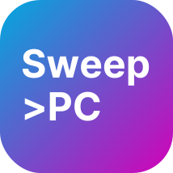

# SweepPC
Get control of your PC and keep it clean with a modern desktop app😎

## Overview
SweepPC provides a simple user interface allowing you to do things like:

- **Temporary Files 📂** Trash those garbage files and caches generated by apps.

- **Manage Hardware 🖥️** Dive in on what's happening with your RAM.

- **File Scan 🔎** View the things you forgot about, find duplicates and similarities, look for large files.

- **Malware Protection 👹** Hunt down those malicious processes hidden from you.
  
## Speed
All file operations and scanning are performed in Rust, while the GUI itself is developed in Python. 
This means it is **FAST** for file management tasks and processing large amounts of data, whilst having a 
clean and efficient user interface.

## The Plan
As of right now, SweepPC is still under active development. We plan to release all beta and alpha versions for 
free, but any stable releases will be available for a one-time payment of $20 on the official MP Software website. 
Our goal is to stay away from a SaaS approach (no subscription) and release SweepPC for a lifetime payment. 
